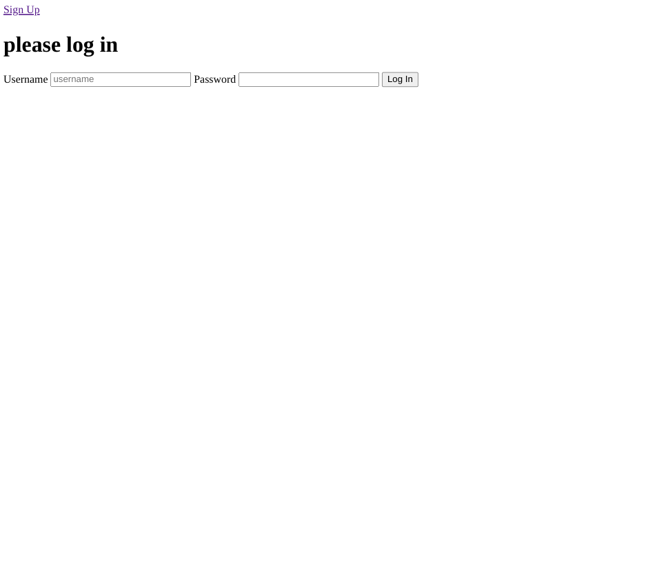
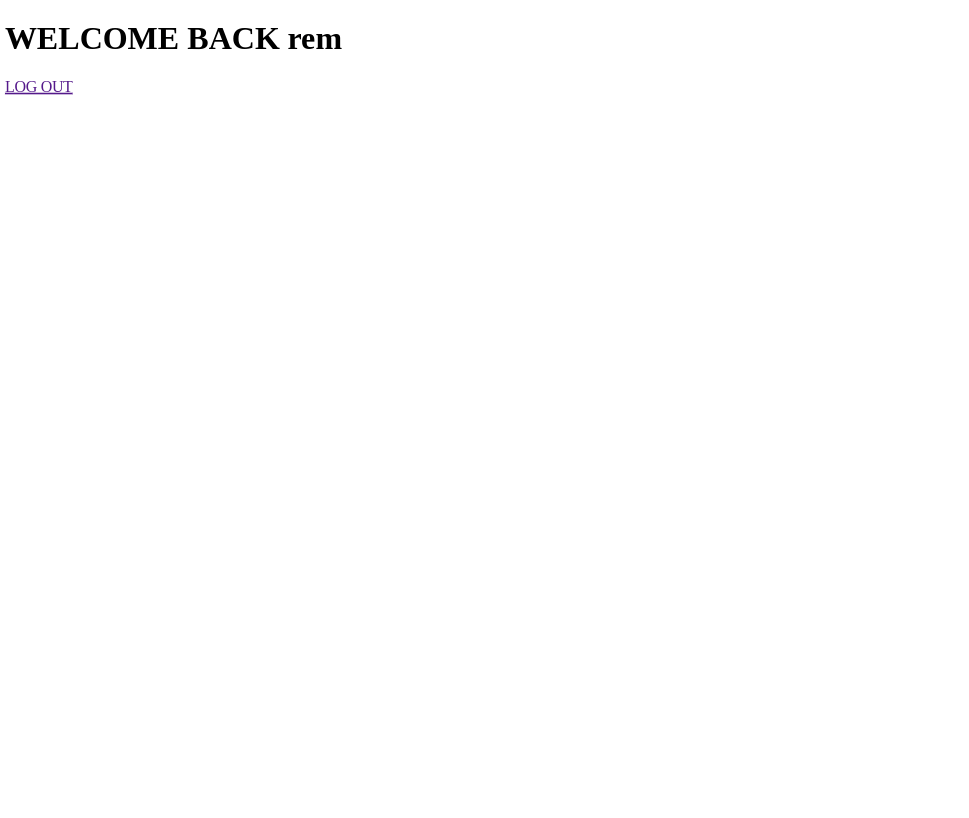

<h1 align="center">Authentication Basics</h1>

   Exercise from  <a href="https://www.theodinproject.com/paths/full-stack-javascript/courses/nodejs/lessons/authentication-basics" target="_blank">theodinproject.com</a>.

## Table of Contents

- [Overview](#overview)
  - [Built With](#built-with)
- [Features](#features)
- [Improvements](#improvements)
- [Useful Resources](#useful-resources)

## Overview

### Built With

- Express
- Passport
- EJS
- Mongoose
- Bcrypt
- Mongo

## Features

Simple login/logout functionality from passport-local.  

## Improvements

- File Structure i.e. models & routes folders, etc

### Useful Resources

- [Passport](https://www.passportjs.org/)
- [Stack Overflow](https://stackoverflow.com/questions/35604730/nodejs-express-error-failed-to-lookup-view-error-in-views-directory) - views 
- [Github](https://github.com/expressjs/express/blob/master/examples/ejs/index.js) - EJS setup
- [Hey Node](https://heynode.com/blog/2020-04/salt-and-hash-passwords-bcrypt/) - Bcrypt salting and hashing
- [Stack Overflow](https://stackoverflow.com/questions/48799894/trying-to-hash-a-password-using-bcrypt-inside-an-async-function) - Async and bcrypt
- [Stack Overflow](https://stackoverflow.com/questions/67254721/how-to-prevent-user-from-going-back-with-browser-after-signup) - Prevent going back to login route
